# Rust Programming Cookbook Çalışma Alanım

Bir süre önce aldığım [Rust Programming Cookbook](https://amzn.to/3Bw5ysw) kitabını çalışmak için açtığım bir çalışma alanıdır. İş hayatında sürekli .Net platformunda ve C# ile kod geliştirdiğimden Rust ile yazma alışkanlığım son derece zayıf. Önceden çalıştığım pek çok konuyu unutmuş durumdayım. Kitabın anlattığı kodları copy-paste yapmadan bakarak yazmayı, bu sayede parmaklarımı rust sözdizimine alıştırmayı ve kısa notlar tutarak önceden baktığım konuları biraz daha özümsemeyi amaçlıyorum.

## Ön Hazırlıklar

Her şeyden önce çalışmalarımı Windows 10 tabanlı bir sistemde yapmaktayım. Rust'ın kurulumu için kitabın da önerdiği üzere [https://rustup.rs](https://rustup.rs) adresine gidip indirdiğim installer'ı çalıştırdım. Kurulumun başarılı olup olmadığını görmek için komut satırından _rustc --version_ komutunu çalıştırdım.

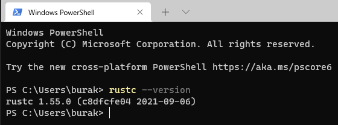

Geliştirmeler için Visual Studio Code kullanacağım. Rust eklentisi için command-line interface'i açıp(Ctrl+P) sonrasında _ext install rust-lang.rust_ komutunu çalıştırmak yeterli.

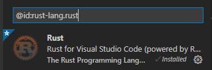

## day01

Kitabın birinci bölümüne ait çalışmalar.

### Komut Satırı ile Temel İşlemler

```bash
# Terminalden aşağıdaki komut çalıştılır ve ilk proje oluşturulur
cargo new wonderful-world

# Örneği çalıştırmak içinse (Tabi kodlama yaptıktan sonra :) )
cd wonderful-world
cargo run
```

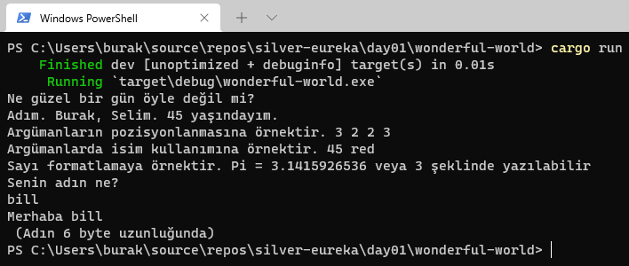

### Veri Türleri

```bash
# Bu sefer bir kütüphane oluşturuyoruz
cargo new data-types --lib
cd data-types
# test fonksiyonları üstünden ilerliyoruz
cargo test
```

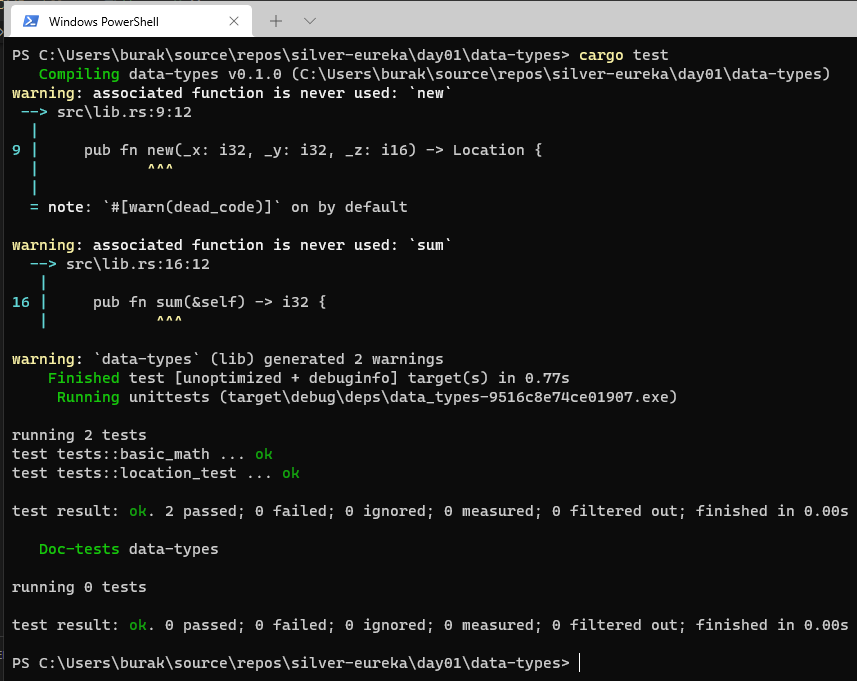

### Karar Yapıları ve Döngüler

```bash
cargo new flows --lib
cd flows
cargo test
```

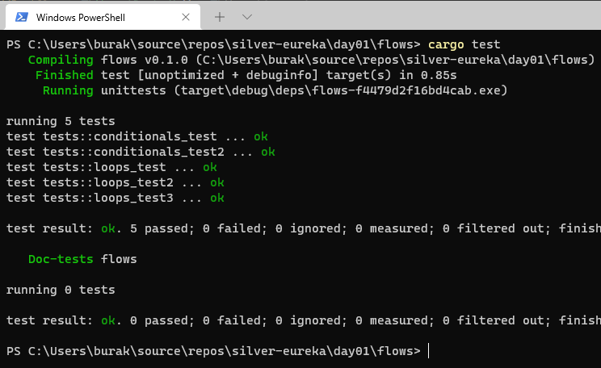

### Sandık(Crate) ile Çalışmak

Fonksiyon içeren bir modül oluşturup diğerinden kullanılması. Tipik yürütücü uygulama ve referans olarak kullandığı kütüphane senaryosu.

```bash
# Kütüphane oluşturulması
cargo new rust-matlib --lib

# ana uygulamanın oluşturulması
cargo new calculator

# ana uygulamada bir modül oluşturulması(klasör içinde mod isimli rust dosyası da oluşturulur)
cd calculator
mkdir basic
cd basic
touch mod.rs

# rust-mathlib testlerini çalıştırmak için, o klasörde,
cargo test

# calculator'u çalıştırmak için o klasörde
cargo run
```

calculator'un rust-matlib'i kullanabilmesi için toml dosyasında gerekli dependency eklenmiştir. Ayrıca calculator projesinde basic isimli bir klasör vardır. Burası basic isimli modülü temsil eder.

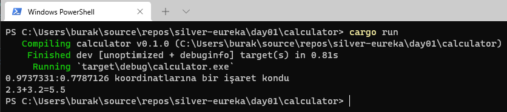

### Dokümantasyon Eklenmesi

Çok basit anlamda markdown stili kullanılarak yardım dokümanı oluşturulabilyor. /// veya ///! ile bu işlemler gerçekleştirilebiliyor.

```bash
cd rust-matlib
cargo doc
```

Sonrasında silver-eureka/day01/rust-matlib/target/doc/rust_matlib/index.html sayfası açılarak Help içeriği görülebilir.

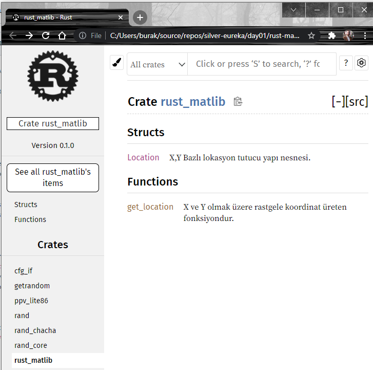

### Trait Kullanımı

Abstract sınıflara benzetebileceğimiz trait enstrümanı ile aynı davranışı birden fazla struct'ın kullanması mümkün olabilir. Örnekte bir key:value çiftinin okunması, yazılması ile ilgili davranış tanımlamaları yapılmakta ve uygulanmakta.

```bash
cargo new traits --lib
```

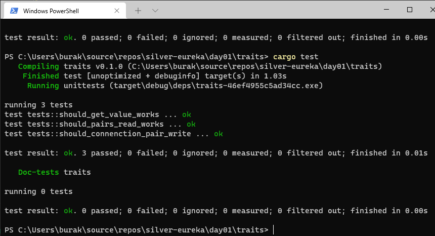

### Sequence Tipleri

Tek bir veri türünden oluşabilen ve boyutu değiştirilemeyen dizi, farklı türden veriler barındırabilen ama boyutu değiştirilemeyen Tuple ve generic tipleri kullanıp dinamik olarak boyutu ayarlanabilen Vector tiplerinin kullanım örnekleri.

```bash
cargo new sequences --lib
cd sequences
cargo test
```

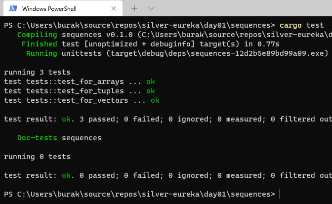

## day02

Kitabın ikinci bölümüne ait çalışmalar.

### enum Kullanımı

Pek çok dilde olduğu gibi Rust tarafında da sayıları anlamlı şekilde isimlendirmek için enum türünden faydalanılıyor ama fazlası da olabilir. Enum sabiti özelliklerinde farklı türleri kullanmak, enum sabitine fonksiyonellik kazandırmak, pattern matching ifadelerinde ele almak vs

```bash
mkdir day02
cd day02
cargo new using_enums --lib
cd using_enums
cargo test
```
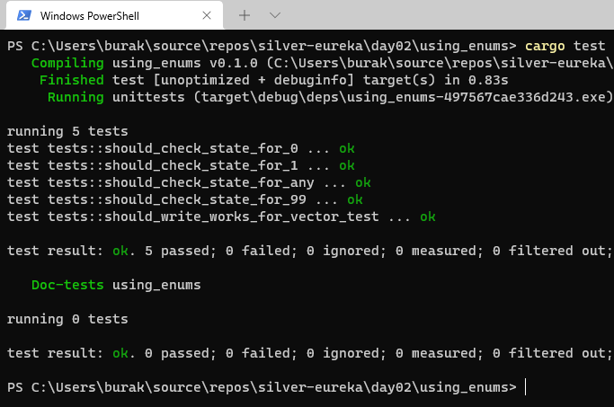

### Null Olmayan Güzel Bir Dünya

Rust dilinde fonksiyonel dillerin bir geleneği olarak her girdinin karşılığında anlamlı bir çıktının üretilmesi amaçlanır. null tipi yoktur. Bunun yerine Option< T> ve Result<T,E> tipleri kullanılır. Bir hata oluşma ihtimali varsa Result enum sabiti tercih edilir. Bu enum türleri aşağıdaki gibidir.

```rust
pub enum Option<T> {
    Some(T),
    None,
}

pub enum Result<T,E>{
    Ok(T),
    Err(E),
}
```

Örnekte Option tipinin farklı kullanım şekilleri ele alınmakta.

```bash
cargo new no_null --lib
cd no_null
cargo test
```

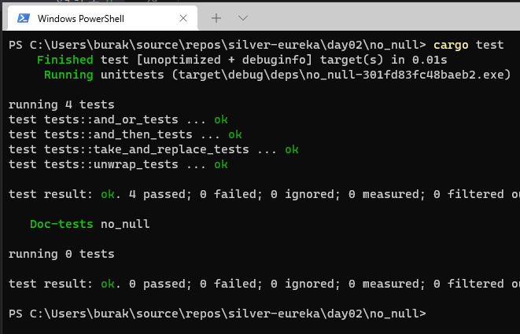

### Pattern Matching için Verimli Kullanım Senaryoları

Pattern matching kabiliyetinin enum'larla sınırlı olmadığına dair örnek kodlar yer alıyor. _(literal, tuple, String(heap allocation sebebiyle diğer literallerden farklı ama kullanım şekli aynı) türleri ile kullanım, destructuring ve guard mevzusu)_

```bash
cargo new amazing_pattern_matching
cd amazing_pattern_matching
cargo run
```

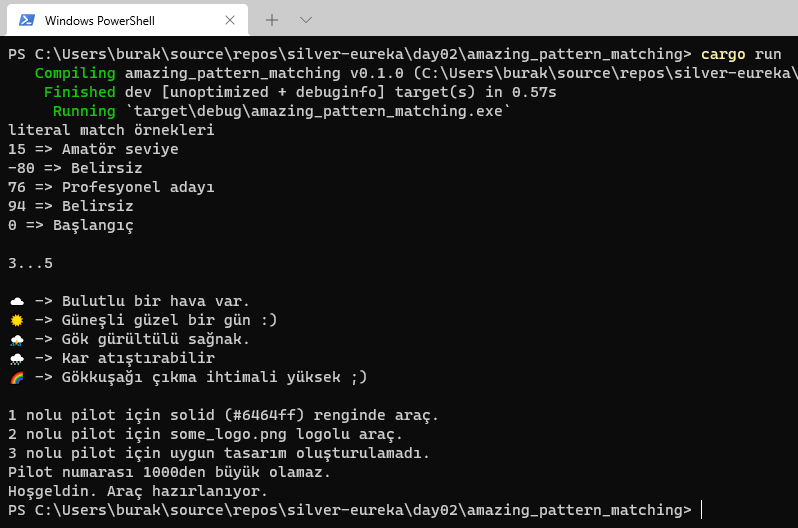

### Basit Bir Linked List Oluşturmak

Kitabın bir sonraki örneğinde Iterator deseni kullanılan bir örnek yer alıyor. Ancak örnek içerisinde generic türden bir bağlı liste _(Linked List)_ kullanılmakta. Önce bu veri yapısını inşa etmeyi öğrenmek gerekiyor. Bu kodda generic verisyona gitmeden bir sürecin sıralı loglarının bağlı liste olarak tutulduğu basit kurgu söz konusu. Her log bilgisi Node isimli bir struct ile temsil ediliyor. ProcessLog isimli veri yapısı Node örneklerini ardışıl olarak tutan bir bağlı liste veri yapısını temsil ediyor.

```bash
cargo new linked_list --lib
cd linked_list
cargo test
```

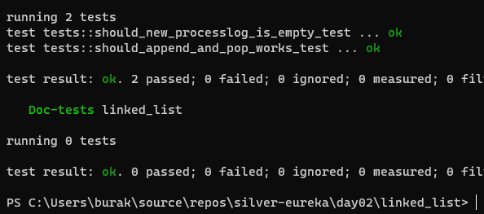

### Özel Yineleyiciler _(iterator)_ Oluşturmak

Örnekte basit bir liste veri yapısının elemanlarında ileri yönlü hareket etmek için iterator deseninden nasıl yararlanıldığı ele alınmaktadır. Bu amaçal Iterator ve IntoIterator isimli standart kütüphanedeki trait'lerin generic List veri yapısı için uyarlanması söz konusudur. Bu uyarlama rust derleyicisi için anlamlıdır ki kendi veri türümüz üstünden next fonksiyonu çağırıldığında veya bir for döngüsü ile kullanıldığında nasıl hareket edeceğinin öğretilmesi gerekir

```bash
cargo new custom_iterator --lib
cd custom_iterator
cd src
# örnekte kullanılan generic liste veri yapısını ayrı bir modüle yerleştirmek için klasör açılır
mkdir list
cd list
touch mod.rs
cd ..
cd ..
cargo test
```

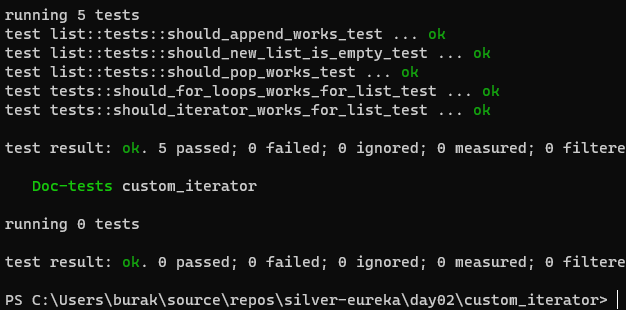

### Yararlı Iterator Kullanımları

Ardışıl eleman yapılarında iter metotu arkasından ulaşılabilen kullanışlı pek çok fonksiyon bulunmakta. next, map, fold, collect, zip, find, position, take vs Bu fonksiyonlar sadece nesne kümelerinde hareket etmek değil dönüştürme _(transformation)_, filtreleme, toplu hesaplama _(aggregation)_ gibi işlemler için de önemli. Örnekte bu fonksiyon kullanımlarına yer veriliyor.

```bash
cargo new iterations --lib
cd iterations
cargo test
```

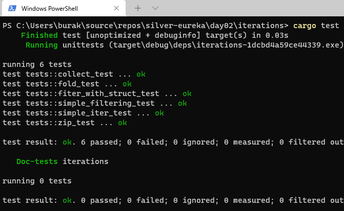

### Unsafe Kodlama

Rust'ın C diline yakınlaştığı yerlerden birisi de unsafe halidir. Unsafe modda iken derleyicinin uygulamayı kontrol eden güven mekanizması kapatılır. Unsafe sayılan fonksiyonların çağırılmasında, mutable işaretlenmiş statik değerlere erişmekte veya değiştirmekte, pointer referanslarının kaldırılmasında vs kullanılabilir.

```bash
cargo new easy_unsafe --lib
cd easy_unsafe
cargo test
```

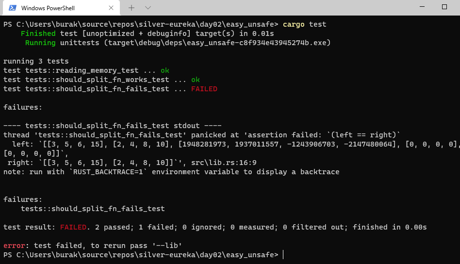

### Paylaşımlı Sahiplik _(Shared Ownership)_

Rust dilinde bir garbage collector mekanizması yoktur. Bunun yerine sahiplenme _(ownership)_ ve ödünç alma _(borrowing)_ kavramları öne çıkar ve oldukça önemlidirler. Mevzu bir değişkenin yaşamı ile ilgilidir. Normal şartlarda scope'lar değişkenleri sahiplenirler ve scope dışına çıkılınca değişken artık kullanılamaz. Tabii sahiplikler iç scope'lara transfer edilebilir ve tekrar geri gelebilir. Geçici transferlerde ödünç alma kullanılır ancak bazı hallerde yönetimleri karmaşıktır. Kitabın bu kısmında paylaşılmış sahiplik ile ilgili örnek kodlar yer alıyor ve smart pointer kullanımının performans açısından önemi vurgulanıyor.

```bash
cargo new shared_ownership --lib
cd shared_ownership

# Örnekte benchmark testi yapıldığından rust'ın nightly build sürümü gerekiyor.
rustup default nightly

# test için
cargo test

# benchmark sonuçlarını görmek için
cargo bench
```

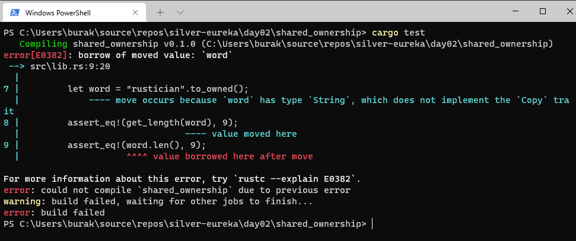

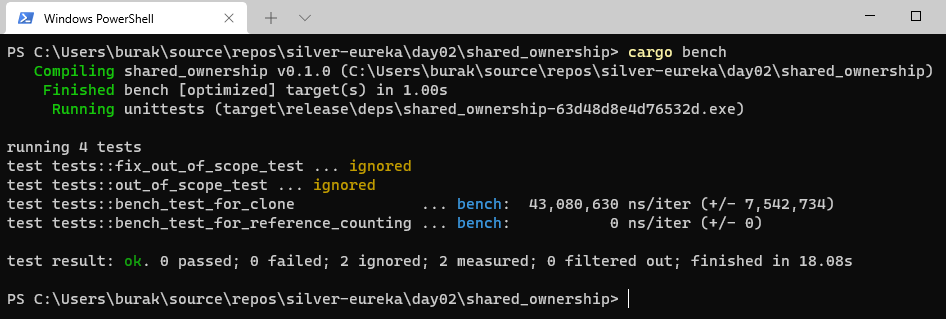

### Değiştirilebilir Paylaşımlı Sahiplik _(Mutable)_

Salt okunabilir verileri sahipliği paylaşarak yönetmek adına bir önceki bölümdeki gibi Rc _(Reference Counting)_ kullanımı yeterlidir. Ancak değeri değiştirilebilir verilerde Refcell, Cell, Cow _(Clone on Write) gibi enstrümanlar ile veriyi referans olarak paylaşmak tercih edilir. Örnekte bu tiplerin nasıl kullanıldığı ve veri değiştirme operasyonlarındaki performans metrikleri ele alınmakta.

```bash
cargo new shared_mutable_ownership --lib
cd shared_mutable_ownership

# Örnekte benchmark testi yapıldığından rust'ın nightly build sürümü gerekiyor.
rustup default nightly

# test için
cargo test

# benchmark sonuçlarını görmek için
cargo bench
```


Test sonuçlar enteresan değil mi? Standart yöntem en performanslısı gibi görünüyor.

Normal test sonuçları, 


ve borrow sonrası borrow_mut kullanılması sırasında oluşan ihlal sonucu panic durumu.

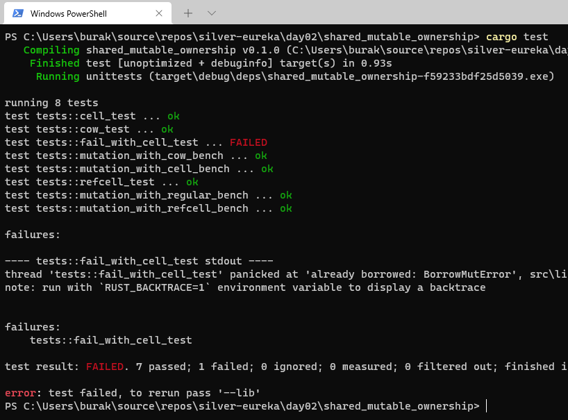

### Referanslar için Yaşam Ömrü Doğrulaması _(Lifetimes Validations)_

Kitabın izleyen bölümünde referansların lifetime belirteçleri ile kullanımına yer veriliyor lakin lifetime mevzusunu biraz unutmuş gibiyim. Öncesinde ne olduğunu hatırlamak üzere izleyen örneğe başvuruyorum. Her referansın scope bazında bir yaşam ömrü _(lifetime)_ vardır. Bunu belli haller dışında açıkça belirtmemize gerek yoktur ancak içiçe scope kullanımları, referansların fonksiyonlara taşınması gibi hallerde Rust'ın ödünç alma kontrol mekanizması _(borrow cheker)_ çalışır ve doğru görünen kod derlenmez. Bu durumda programcının açıkça _(explicit)_ lifetime kapsamını belirlemesi yani referansa dipnot _(annotation)_ eklemesi gerekir.

```bash
cargo new lifetimes --lib
cd lifetimes --lib
cargo test
```

borrow cheker mekanizmasının #1 senaryosunda tespit ettiği ihlal durumu

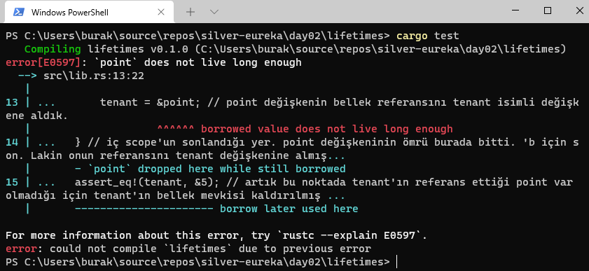

fonksiyona lifetime belirtmeden referans geçtiğimiz #3 nolu senaryodaki ihlal durumu.

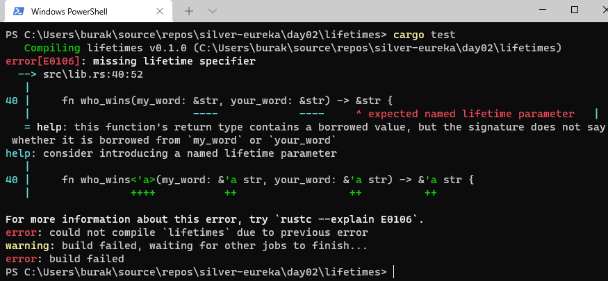

fonksiyon dönüş referansı ile parametrelerin yaşam ömürlerinin uyuşmamasını ele alan #5 senaryosundaki durum.

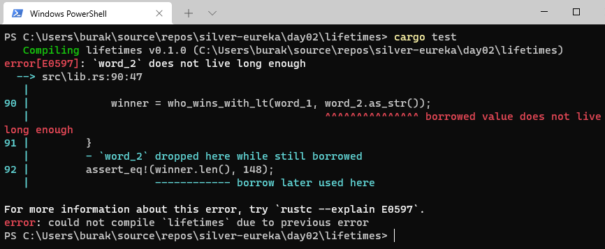

### Referanslar için Yaşam Ömrü Doğrulaması Bölüm 2

Bir önceki örnekle referans türlerinin yaşam sürelerini yönetmeyi hatırladıktan sonra tekrar kitabın ilgili bölümündeki örneğe döndüm. Referans kullanmanın bir sebebi de bellekte sürekli yer ayırıp kopyalama işlemleri nedeniyle oluşacak performans kayıplarının önüne geçmektir. Bununla ilgili kitap düşündürücü bir soru soruyor. Referans edilen orjinal değer scope dışına çıktığında, referansa ne olur? İşte bu noktada lifetimes belirteçleri ile derleyiciye yol göstermek gerekiyor. Örnekte temel bir istatistik hesaplaması için kullanılan Struct veri yapısında lifetimes bilgisinin nasıl kullanıldığı gösterilmekte.

```bash
cargo new lifetimes_2 --lib
cd lifetimes_2
cargo test
```

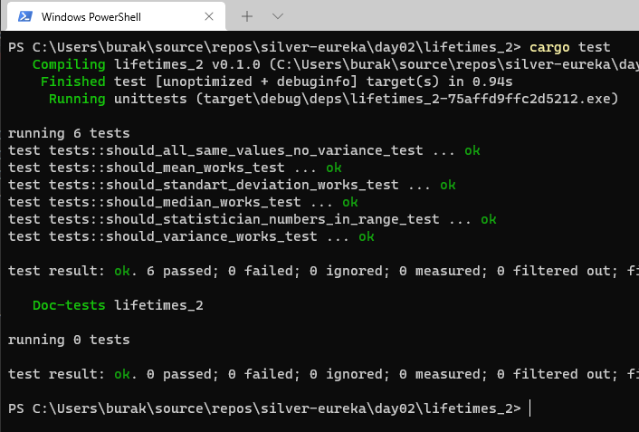

### Trait Bounds

Rust derleyicisine belli bir tipin sahip olduğu ve başka tiplerle ortaklaşa paylaşabileceği davranışları söylemek için bunu soyutlaştırmamızı sağlayan trait enstrümanından yararlanıldığını biliyoruz. Birde trait bounds meselesi var. Örnek bununla ilgili.

```bash
cargo new trait_bounds --lib
cd trait_bounds
cargo test
```

#3 numaralı pratikte Debug Trait bildirimi yapılmadığında derleyicinin verdiği hata aşağıdaki gibidir.

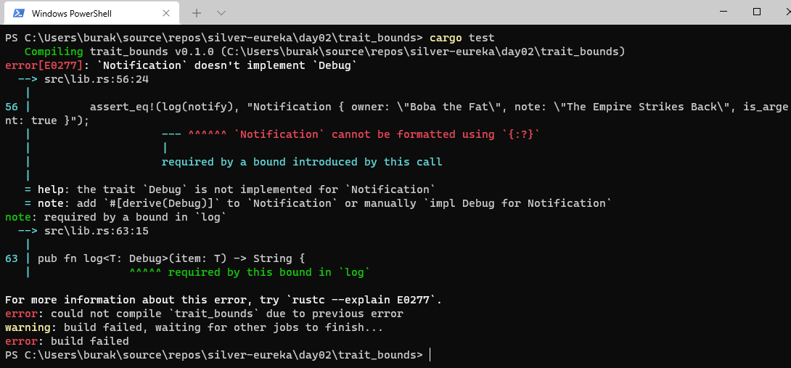

Son çıktı.

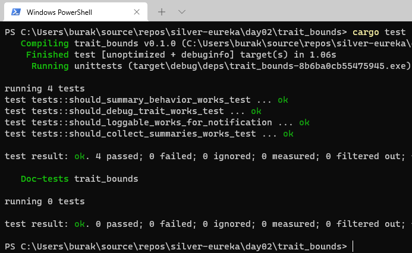

### Generic Veri Türleri

Kitabın bu reçetesinde generic bir veri yapısı nasıl yapılır konusu ele alınmakta. Örnekte ilk olarak bir kompleks sayı veri tipini generic olarak tasarlayıp kullanmaktayız. Ardından generic bir liste türü tasarlıyoruz. Generic liste için data isimli bir modül kullanmaktayız.

```bash
cargo new generics --lib
cd generics
cd src
mkdir data
cd data
touch mod.rs
cd ..
cd ..
cargo test
```

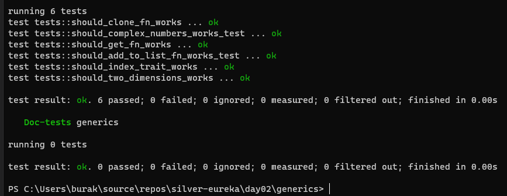

## day03

Kitabın üçüncü bölümüne ait çalışmalar. Bu bölümde cargo aracı ile proje yönetimine ait reçetelere yer verilmekte.

### Workspace ile Çalışmak

cargo aracı her şeyi klasör yapısına göre ele alınır. Klasik bir .net projesindeki Solution için Rust tarafında klasör mantığına göre tasarlanan workspace' ler kullanılır. Özellikle çok sayıda crate içeren projelerde workspace oluşturarak ilerlenir.

```bash
# day03 klasöründen işlemlere devam edilir

# Bir Workspace oluşturulur
mkdir -p rogue-one
cd rogue-one

# main fonksiyonunu içeren ana proje oluşturulur
cargo new program

# program tarafından kullanılacak bir crate kütüphanesi oluşturulur
cargo new utility --lib

# yine örnek bir kütüphane daha eklenir
cargo new business --lib

# cargo komutunu workspace içindeki diğer projeler için tek noktadan kullanabilmek istiyorsak
# workspace root klasöründe bir cargo.toml dosyası açıp içeriğini ilgili projelerle donatmalıyız
# örnek için rogue-one klasöründe.
touch cargo.toml

# sonrasında rogue-one klasöründe run, test ve build gibi komutları kullanabiliriz

# main fonksiyonunun olduğu program çalışır
cargo run

# workspace projesinde ne kadar test varsa koşulur
cargo test
# dilersek workspace içerisindeki sadece belli bir projenin testlerini işlettirebiliriz.
cargo test -p business

# build işlemi için
cargo build
```


_cargo build_ işlemi sonrası çalıştırlabilir binary dosyaları target klasörü altında konuşlanacaktır.

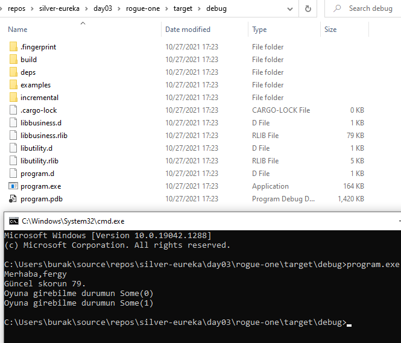

### crates.io ile Çalışmak

Dilersek kendi kod sandıklarımızı _(crate)_ herkesin erişimine açabiliriz. Bunun için ilgili paketleri uygun şekilde crates.io sitesine yüklemek yeterlidir. İlk olarak [crates.io](crates.io) sayfasına gidilir ve var olan github hesabı ile login olunur. Sonrasında __Account Settings__ kısmına gelinir ve API erişimi sağlanabilmesi için yeni bir token istenir. Sonuç itibariyle sistemimizde cargo aracını kullanarak crates.io ile çalışmak için bir şekilde kendimizi doğrulatmalıyız. Bu işlemi terminalden aşağıdaki komutu vererek yapabiliriz.

```bash
cargo login [buraya sizin için üretilen token eklenecek]

# sonrasında yeni bir crate oluşturarak ilerleyebiliriz
cargo new event-queue --lib
cd event-queue
cargo test

# crates.io' da görünmesi amacıyla bir Readme.md dosyası da eklenir.
# sonrasında paketin oluşturulması için aşağıdaki komut kullanılır.
# Bu işlem öncesinde commit edilmemiş kod kalmamalı ve ayrıca cargo.toml dosyasında paket için gerekli tüm bilgiler yer almalıdır.
cargo package

# Ardında paket crates.io ortamına yollanır.
cargo publish
```

Uygulamanın test sonuçları;

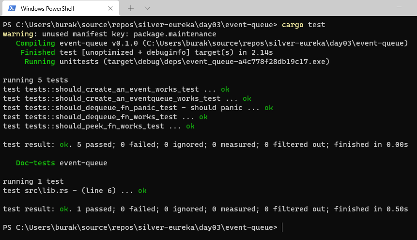

Eksik commit varsa;

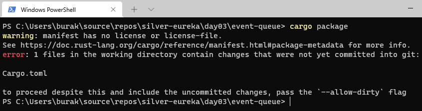

Package oluşturma ve publish işlemleri başarılı oluşursa;

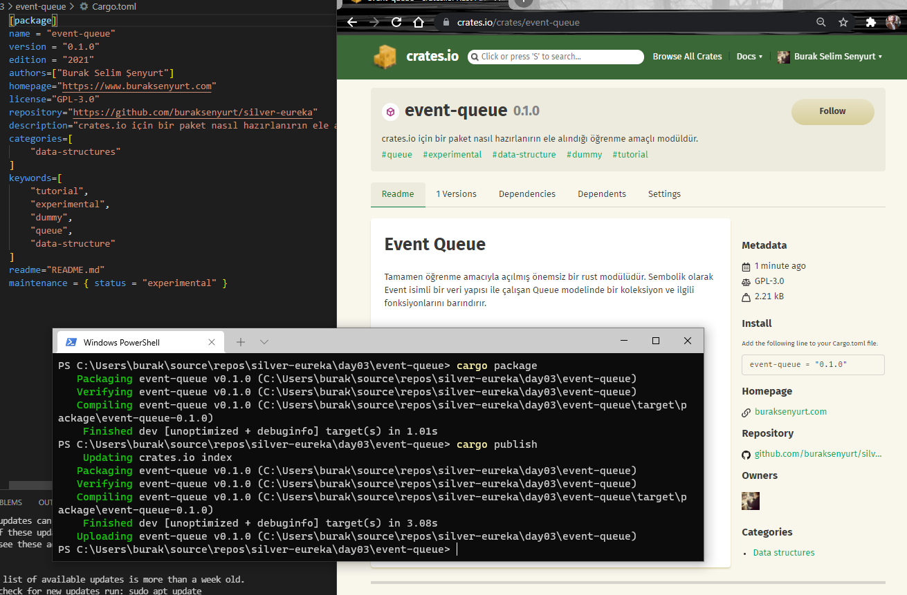

### Dış Kütüphanelerin Kullanımı

Pek çok programlama platformunda olduğu gibi Rust için bir paket yönetim sistemi mevcut. Cargo bunu sağlamakta. Önceki örnekte bir crate tasarlayıp crates.io sitesine yüklemiştik. Bu tip bağımlılıkları _(dependencies)_ projelerimizde kullanmak için cargo.toml dosyasında gerekli düzenlemleri yapmak gerekiyor. Kullanılacak kütüphaneleri crates.io'dan veya github gibi kaynaklardan alabiliriz. Kitabın ilgili bölümünde buna ait bir örnek geliştirilmekte.

```bash
cargo new external-libraries --lib
cd external-libraries

# toml dosyasına [[bench]] kısmı eklendikten sonra
mkdir benches
cd benches
touch fibonacci_performance.rs

cd ..
cargo test

# benchmark testleri için
cargo bench
```

Test sonuçları;

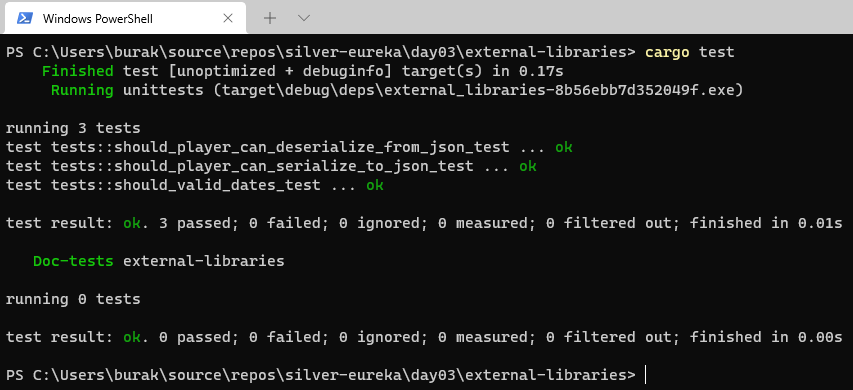

Benchmark sonuçları;

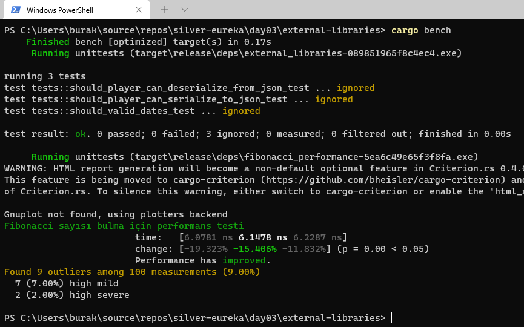

### Test İpuçları

Şu ana kadarki kodlarda ağırlıklı olarak test yazıldı. Sıradaki reçetede testlerle ilgili farklı özelliklere de yer verilmiş.

```bash
cargo new more-test --lib
cd more-test

# testleri koşturmak için normalde aşağıdaki komut veriliyor
cargo test

# sadece belli bir testin koşulmasını aşağıdaki komutla sağlayabiliriz
cargo test tests::sum_of_two_works_test

# test fonksiyonlarından terminale bilgi verilen print çağrılarını da görmek için aşağıdaki komutu kullanabiliriz
cargo test -- --nocapture

# çalıştırmak istediğimiz testleri içinde geçen kelimelere göre filtreleyerek koşturabiliriz
cargo test seconds

# Paralel koşan testlerin thread sayılarını kontrol edebiliriz. 
# Örneğin hepsinin tek bir thread içinde koşmasını istersek aşağıdaki terminal komutunu kullanabiliriz.
# 1 yerine kaç thread açılmasını istersek yazabiliriz.
cargo test -- --test-threads 1
```

_cargo test_ çalışmasında ilk dikkat çekici nokta testlerin eş zamanlı olarak başlatılması ve paralel koşmalarıdır. Bu nedenle toplam çalışma süresi en çok beklenen thread süresi kadar sürmüştür. Ayrıca _[ignore]_ ile işaretlenen test atlanmıştır.

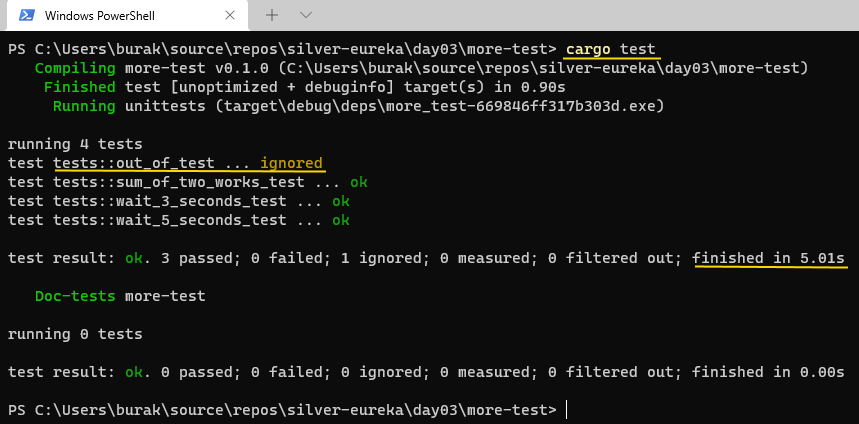

Sadece belli bir testin koşulması;

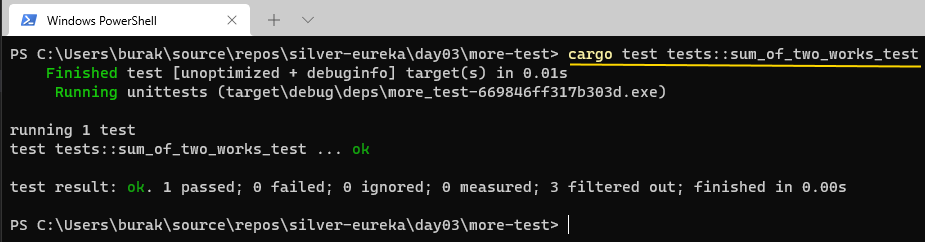

nocapture ile println! makro çıktılarının görülmesi;

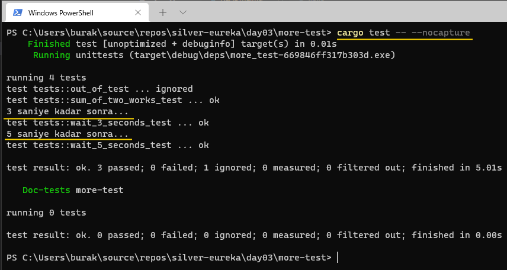

İçinde seconds kelimesi geçen testlerin koşturulması;

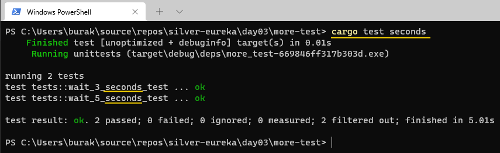

Testlerin tamamının tek bir thread içinde koşturulması;

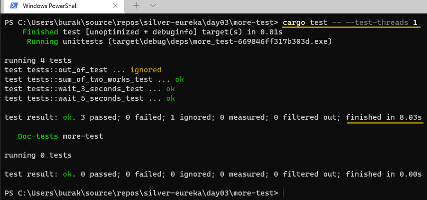

## Concurrency

Rust dilinin güçlü olduğu yerlerden birisi de eş zamanlılık ve paralel çalıştırma işleridir. Sahiplenme _(Ownership)_ ve ödünç alma _(borrowing)_ yetenekleri özellikle veritabanı dünyasında sıklıkla karşılaşılan veri odaklı anormalliklerin _(data races)_ benzerlerinin program tarafında yaşanmasını önler. Bunun en büyük sebeplerinden birisi aksi belirtilmedikçe değişkenlerin değiştirilemez _(immutable)_ olması ve değiştirilebilir _(mutable)_ değişkenler söz konusu olduğunda da bu değişken verisine sadece bir tek referans verilmesinin sağlanmasıdır. Bu tip kısıtlar Rust tarafındaki Concurrency yetkinliklerinin diğer dillere göre nispeten daha kolay ele alınmasını sağlamakta. Kitabın bu bölümünde Concurrency ile ilgili çeşitli örneklere yer verilmekte.

İlave bilgiler;

- Race Conditions: thread'lerin veri veya kaynaklara tutarsız sırada erişmesi.
- Deadlocks; iki thread'in birbirini beklemesi ve işlerini bitirmek için birbirlerinin sahip olduğu kaynaklar üzerinde işlem yapmaya çalışması.
- Rust standart kütüphanesi 1:1 thread modelini destekler. Bir sistem programlama dili olduğundan green-threading model olarak da anılan M:N için çeşitli crate desteği vardır.

### Temel Operasyonlar

Kitabın sonraki bölümünde önce thread kullanımı için temel bir örnek yapmak iyi olabilir.

```bash
cargo new thread-fundamentals
cd thread-fundamentals
cargo run
```

İlk çalışmada dikkat edilmesi gereken nokta içerideki thread daha işini bitirmeden ana thread'in _(main fonksiyonu)_ sonlanmasıdır.

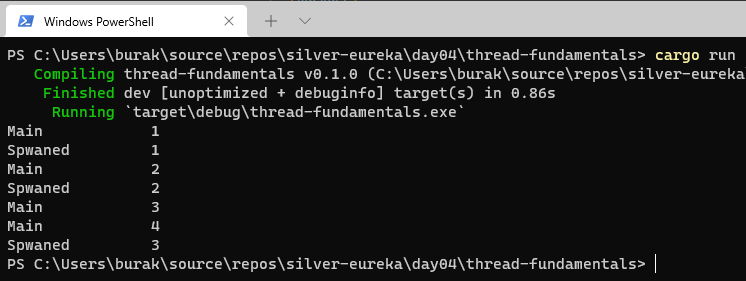

İkinci çalışmada _(case2 fonksiyonu)_ ana thread'in diğer thread'in işleyişini bitirmesi join çağrısı ile sağlanır. Bir süre iki thread'den değerler alınır sonra kalan thread'in işleyişinin tamamlanması beklenir.

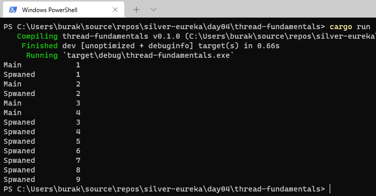

join fonksiyonu ile bekletmenin yapıldığı yer de önemlidir. Örneğin 14ncü satırdaki join çağrısını ana thread'in işleteceği for döngüsü önüne(8nci satır) alırsak farklı bir sonuç elde ederiz. Önce t1'in bitmesi beklenir sonrasında ana thread'in işleri yapılmaya başlanır.

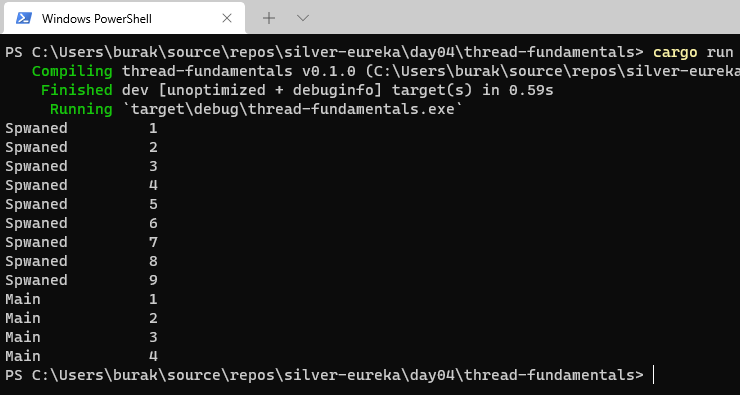

### Veriyi Yeni Thread'lere Taşımak

İlk örnekte spawn fonksiyonu ile oluşturulan thread'lerde veri paylaşımı konusu ele alınmakta.

```bash
cargo new simple-threads
cd simple-threads
cargo run
```

Başlangıçta ana thread içinden başlatılan başka bir thread'in işini bitirmesi bekleniyor.


İkinci senaryoda içinde thread başlatan bir fonksiyona main içinden tanımlı değişkenler gönderiyoruz. Bu değişkenleri diğer thread'te kullanmak istediğimizde ise borrow checker mekanizması devreye giriyor ve aşağıdaki hatayı alıyoruz.

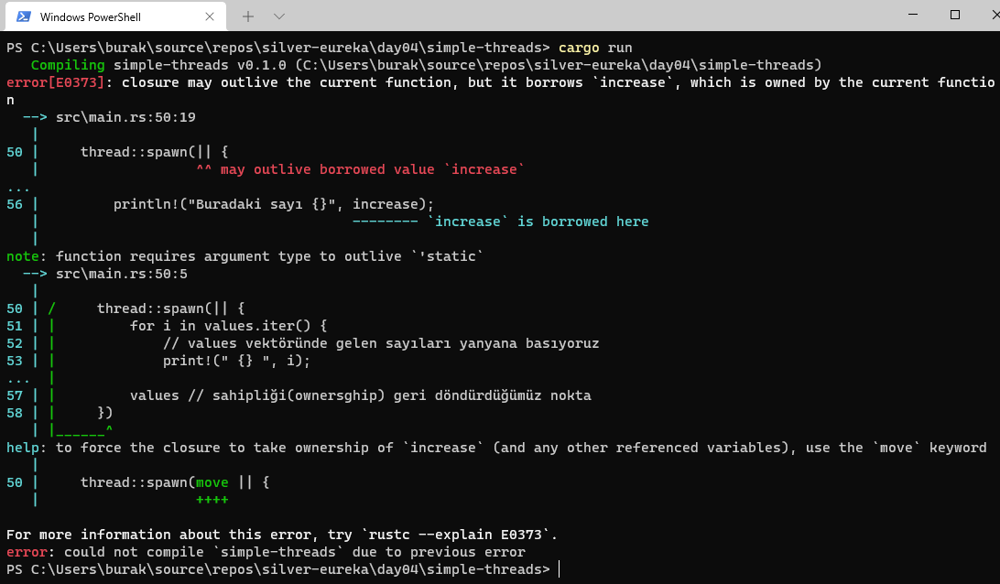

Hatanın çözümünde spawn fonksiyonunda move kullanılması yeterli. move ile thread için söz konusu olan varsayılan ödünç alma davranışını değiştirip ana scope'tan thread'in açıldığı scope'a taşınabilmesine izin veriyoruz. Taşınabilecek değişkenlerin Copy trait'ini uygulamış olmaları önemli.

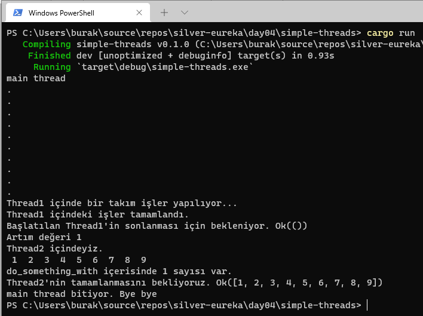

### Çoklu İş Parçacıkları _(Threads)_ Oluşturmak

Büyük ölçekli veri kaynakları üzerinden paralel olarak işlemler çalıştırmak önemlidir. Bu amaçla sıkılıkla kullanılan yöntemlerden birisi de map/reduce tekniğidir. İzleyen kod parçasında birden fazla iş parçacığının birlikte ele alınması konusu incelenmekte.

```bash
cargo new multiple-threads
cd multiple-threads

cargo run
```

Toplam işlem süresi ve oluşan thread numaralarının ele alındığı çalışma çıktısı.

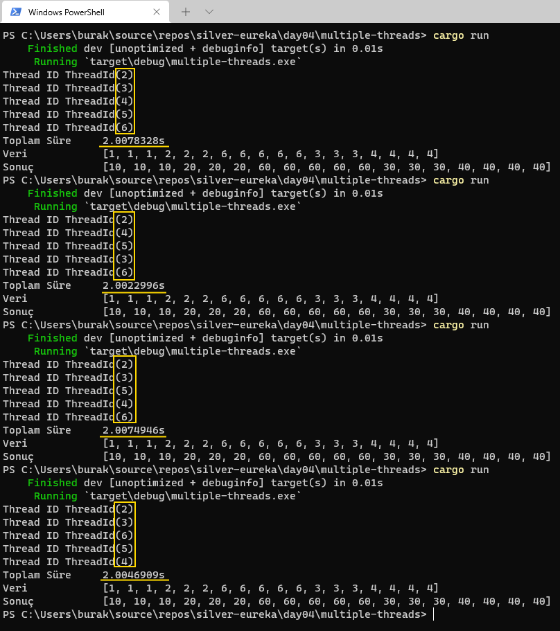

### İş Parçacıkları Arası Haberleşme için Kanal _(Channel)_ Kullanımı

Kitabın bu reçetesinde thread'ler arasında deadlock gibi sorunlara sebebiyet vermeden mesaj alışverişinde bulunabilmek için kanallardan nasıl yararlanıldığı örneklenmte. İlk örnekte üç adet mesaj yayıcı söz konusu.

```bash
cargo new thread-channels
cd thread-channels

cargo run
```

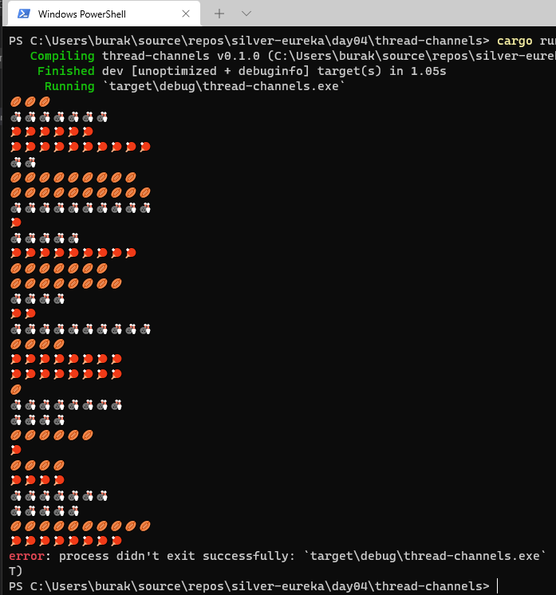

### İş Parçacıklarında Ortak Nesne Kullanımı

Pek çok çözümde n sayıda iş parçacığının aynı veri kümesi üzerinde çalışması ve doğal olarak verinin durumunun _(state)_ sürekli değişimi söz konusudur. Lakin bazı durumlarda bu thread işleyişinin sıralı şekilde kontrol altına alınması gerekebilir. Bu gibi durumlarda ağırlıklı olarak Mutex _(MUTual EXclusion)_ veya Semaphore gibi yapılar kulanılmakta. Kitabın sıradaki reçetesinde Mutex ile ilgili bir konu incelenmekte. Örnekte aynı vektör içeriğine sıralı olarak veri yazan n sayıda thread'in işleyişi ele alınmaktadır.

```bash
cargo new sharing-mutable-states
cd sharing-mutable-states
cargo run
```

Örnekte çalışan 4 iş parçacığı aynı vektöre Odd ve Even değerlerini sırayla ekler. Her bir iş parçacığı vektördeki son değişimleri bilir. Vektör eleman sayısı 10'a geldiğinde iş parçacığında yer alan sonsuz döngüden ve iş parçacığından çıkılır. Her bir iş parçacığı için geriye kalan bir ekleme işlemi daha söz konusudur. Bu nedenle vektör 14 elemanlı olarak oluşur.

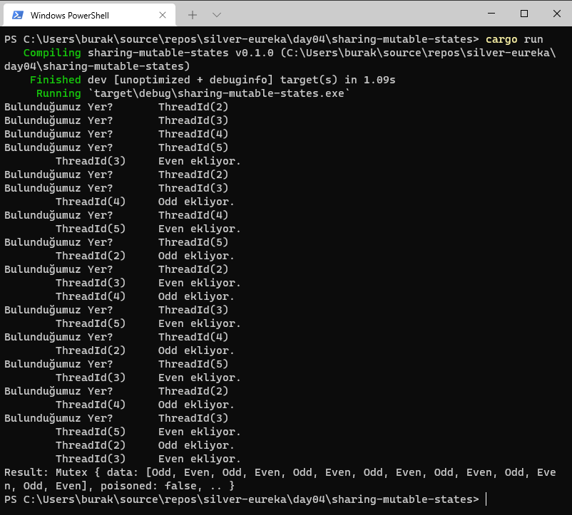

### Process Başlatma ve Çoklu Process Kullanımı

İşletim sistemlerinde uygulamalar process'ler içerisinde çalışır. Rust ile de harici process'leri kod içerisinde başlatmak mümkündür ki bunlar alt process'ler de olabilir. Kitabın bu bölümünde başlatılan bir process'in girdilerinden elde edilen çıktıların başka bir process'e girdi olarak verilmesi de örneklenemkte. Ama öncesinde temel process çağırımlarına bakmak lazım. İlk denemede kobay ve hiçbir işe yaramayan ama terminalden komut alarak çıktı üreten bir programın, bir rust kodu içerisinden çalıştırılması söz konusu. Reçetede dikkatimi çeken bir ifade de günümüz orkestra aktörlerinden Kubernetes, Docker Swarm, Mesos'a bir cümle ile atıfta bulunulmuş olması. Bu tip container sistemleri sebebiyle child process'lerin yönetiminin de önemli hale geldiğine değiniliyor.

```bash
# Sembolik olarak komut satırından parametre olarak gelen şehrin hava durumu bilgisini verecek bir binary'miz olsun.
cargo new weather
cd weather
cargo run

# Bu da weather uygulamasını process olarak çağırıp sonucunu alacak olan program
cargo new simple-process
cd simple-process
cargo run

# Kendi içinde processleri haberleştiren diğer örnek
cargo new multi-process
cd multi-process
cargo run
```

Weather isimli exe'nin terminalden örnek çalıştırılması.

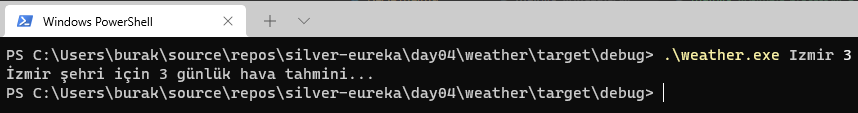

Weather isimli uygulamayı kendi içinden çağırıp çıktısını alan diğer uygulamanın örnek çalışması.

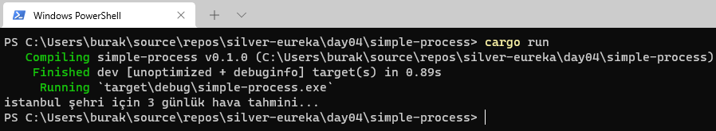

cat ile pipeline'a bilgi yazıp onu okuyan alt processler örneğini bir bash terminalde denemek gerekiyor. _(Linux olduğu için)_

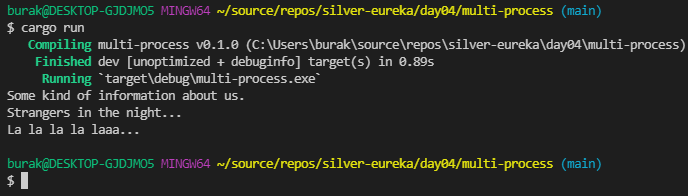

### Paralel Çalıştırma

Bu reçetede sıralı yürütülen işleri paralel çalışacak hale getirmek üzerinde durulmuş ve Rayon [Rayon-Rs](https://github.com/rayon-rs/rayon) isimli bir crate'in kullanımı örneklenmiş. Ayrıca sonuçları karşılaştırmak için benchmark testleri yapılmış. Örnekte bir sayı dizisindeki sayıların karelerinin toplamı ele alınıyor. Ancak iterasyon hem normal hem de rayon paketi sayesinde paralel işletilmekte. Küçük veri kümesi üzerinde çok fark yok ancak tersi durumda süre farkı oluşuyor.

```bash
cargo new parallelism --lib
cd parallelism
cargo test

# benchmark ölçümleri içinse
mkdir benches
cd benches
touch benchmarks.rs
cd ..
cargo bench
```

Test çıktıları;

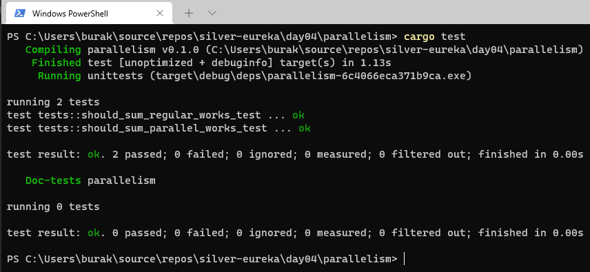

Benchmark sonuçlar _(100.000.000 luk rastgele int kümesi için)_

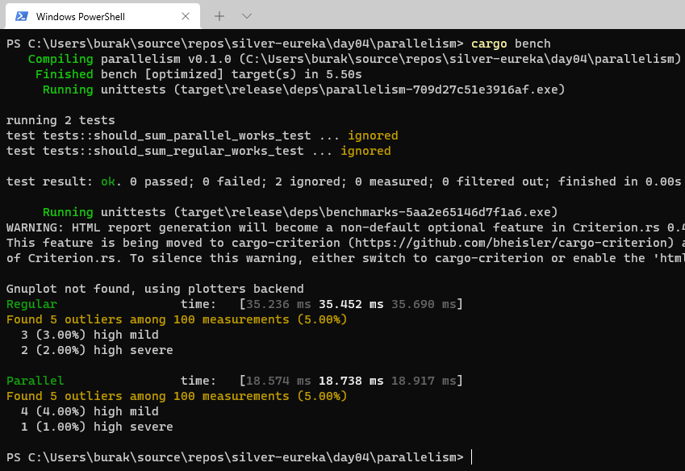

### Kısa Bir Mola _(Ownership Mevzusunu Hatırlamak)_

Arada bir Rust'ın temel bilgilerini hatırlamakta yarar var. Ownership konusu bunlardan birisi. İyi hatırlamak lazım. İzleyen örnek bu amaçla yazıldı.

```bash
cargo new remember-ownership
cd remember-ownership
cargo run
```

İlk durum. Drop konusu.

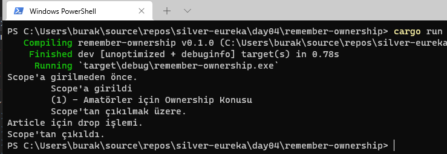

İkinci durum. Move.

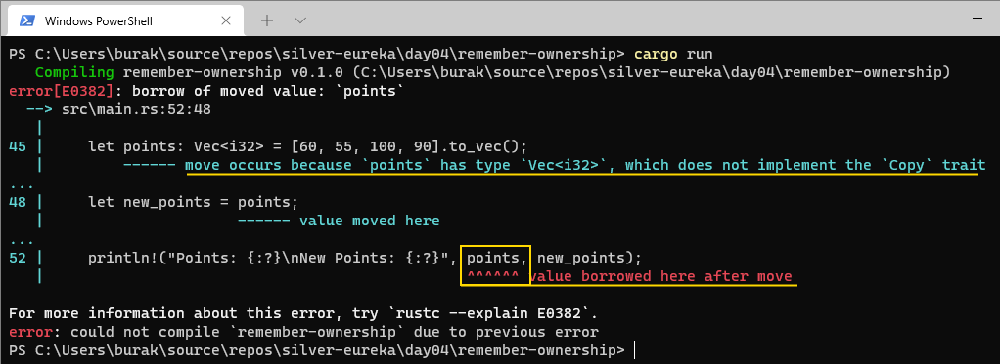

Üçüncü durum. Fonksiyon parametrelerinde move durumu.

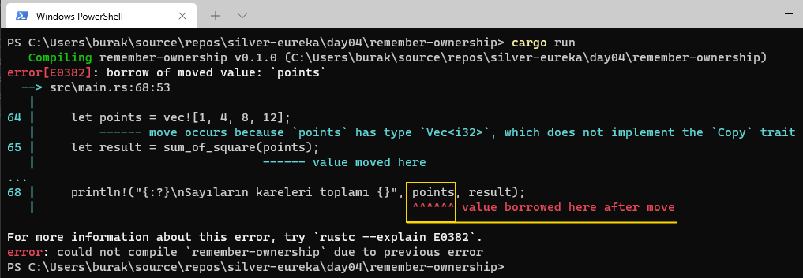

Beşinci durum. Kendi struct türümüzde Copy, Clone trait'lerini uygulamadığımızda move operasyonlarının sonucu. _(Beklendiği üzere)_

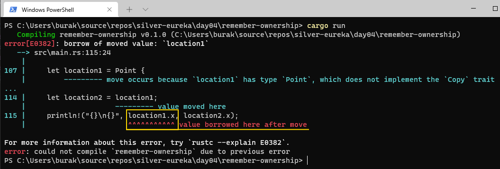

Dokuzuncu durum. String literal'de lifetime durumuna dikkat etmezsek.

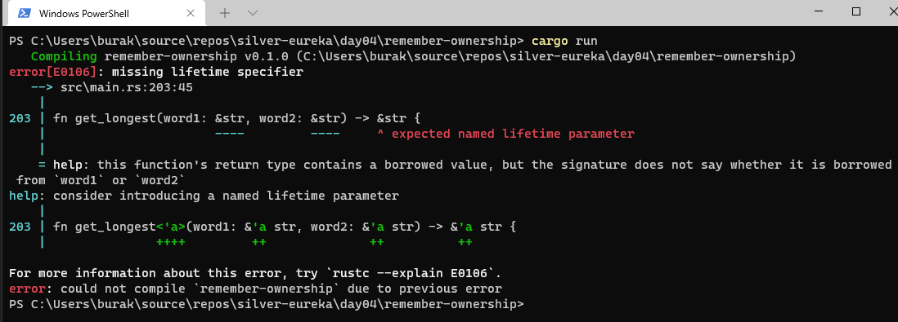